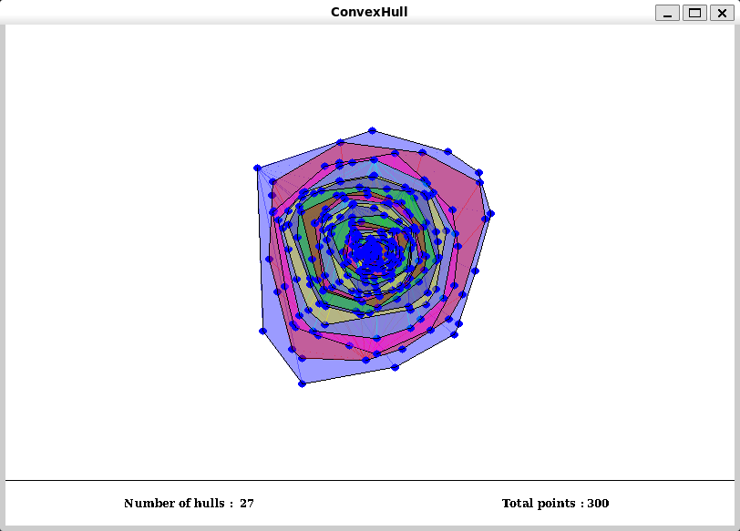
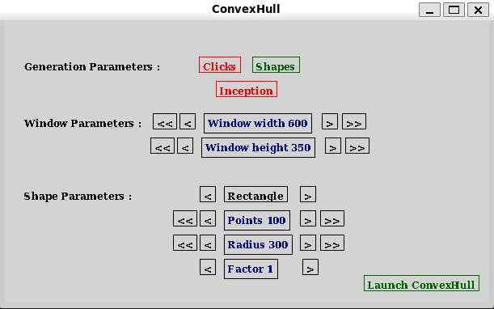

# Convex Hulls
Laborde Quentin - Kies Rémy
___



- [Convex Hulls](#convex-hulls)
  - [Download and run](#download-and-run)
  - [Cleaning](#cleaning)
  - [Menu](#menu)
  - [User commands](#user-commands)

## Download and run

To download the repo, you can either download the .zip file for this project, or use git commands as bellow :
```bash
git clone https://github.com/GouruRK/enveloppe-convexe.git
```

To compile it, go in the `enveloppe-convexe` folder and run the `make` command.
```bash
cd enveloppe-convexe
make
```

Once compiled, run by typing `./convexhull`.

**IMPORTANT :** This project require [libMLV](https://www-igm.univ-mlv.fr/~boussica/mlv/api/English/html/download.html) to run. You can installing by using `universe`, or by using [this link](https://www-igm.univ-mlv.fr/~boussica/mlv/api/English/html/download.html)

```bash
sudo apt update
sudo add-apt-repository universe
sudo apt install libmlv3-dev
```
## Cleaning

To clean the project, use the `mrproper` command :
```bash
make mrproper
```

## Menu

Once the progamm is running, you have access to the following menu.



It allows you to easily decide what render. 
* The first line let you choose if you want to randomly generate a shape (default), or using your mouse to create points.
* The second line let you decide if you want to create self-contained convex hull (Inception) or not.

* The third and fourth lines are for the window size.
* The last lines are generation settings, which are only applied if you choose the shape generation.

## User commands

* Use `left-click` to add points in the 'click generation'.
* Press `H` to toggle the drawing of points, only in the 'shape generation'.
