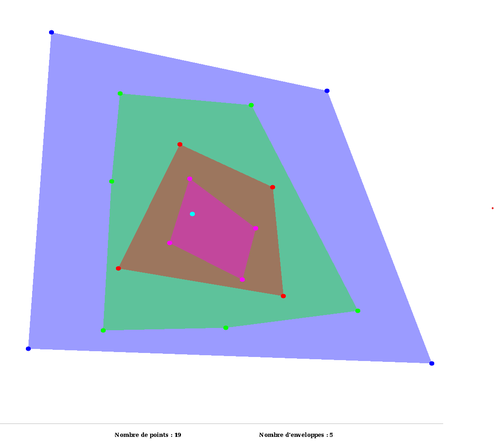

# Projet 1 Programmation C - Enveloppes Convexes
Laborde Quentin - Kies Rémy

TD C - TP 5
___



Sommaire

- [Projet 1 Programmation C - Enveloppes Convexes](#projet-1-programmation-c---enveloppes-convexes)
  - [Comment compiler](#comment-compiler)
    - [Makefile](#makefile)
    - [Fichier par fichier](#fichier-par-fichier)
  - [Documentation](#documentation)
  - [Bug connu](#bug-connu)

## Comment compiler

### Makefile
Une fois dans le dossier du projet `enveloppe-convexe`, l'utilisateur peut lancer la compilation du projet avec la commande `make`.
```bash
cd enveloppe-convexe
make
```

Il est possible d'avoir quelques des warnings : ils correspondent au lien entre les différents fichiers compilés. L'utilisateur ne doit pas en tenir compte

Une fois la compilation achevée, l'utilisateur dispose d'un exécutable `main`.

### Fichier par fichier
Il est également possible de compiler le projet fichier par fichier. Une fois dans le dossier du projet `enveloppe-convexe`, voici les différentes étapes :

```bash
cd enveloppe-convexe
clang -c ./utils/args/errs.c -Wall -std=c17
clang -c ./utils/list/list.c -Wall -std=c17
clang -c ./utils/math/math.c -Wall -std=c17
clang -c ./utils/graphic/draw.c -Wall -std=c17
clang -c ./utils/graphic/graphic.c -Wall -std=c17
clang -c ./utils/graphic/enveloppe.c -Wall -std=c17
clang -c ./utils/graphic/inception.c -Wall -std=c17
clang main.c errs.o list.o math.o draw.o graphic.o enveloppe.o inception.o -Wall -std=c17 -o main -lMLV -lm
```

L'utilisateur dispose alors d'un exécutable `main`.

## Documentation

Vous pouvez accéder a la documentation Doxygen en cliquant [ici](./html/index.html).

*Si le fichier ne s'ouvre pas, utilisez la commande* `doxygen doxygenfile` *depuis le dossier du projet `enveloppe-convexe` pour créer la documentation.*


## Bug connu
Le seul bug connu est pour fermer la fenêtre une fois la simulation lancé. 
* Si l'utilisateur lance le programme avec la génération des points au click, pour fermer la fenêtre, il doit cliquer sur la "X" puis cliquer une nouvelle fois sur la fenêtre.
* Si l'utilisateur lance le programme avec la génération aléatoire, il n'y a aucun moyen de fermer la fenêtre avant que la simulation ne soit terminé.

Ce bug vient de la gestion de fenêtres et des inputbox avec la lib MLV, ou la fonction d'exit est la même (et pas moyen de faire autrement avec les inputbox ...) 
___
Quentin Laborde - Kies Rémy